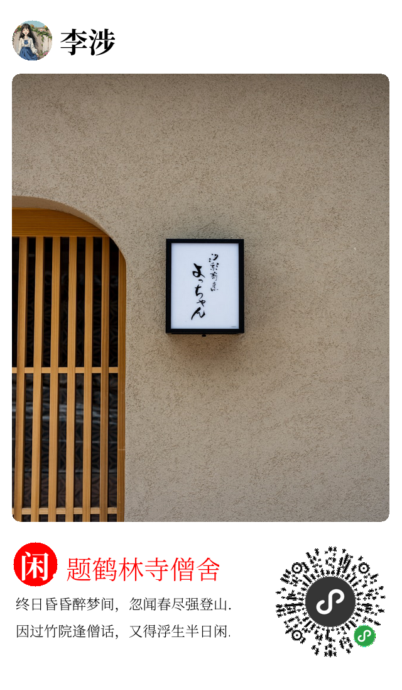

# goposter

这是一个通过golang来生成海报的库，通过简单的配置，即可实现美观海报的生成

## 简单入手
* 依赖
    * 此程序由于需要支持webp格式图片，是以对webp的环境有些依赖，需要在linux中按照gcc才能跑起来
        > 也可以切换到无webp图片的分支使用，这样就是纯纯的go程序:`git checkout nowebp`
    * go版本：乱搞即可
* 可以参考`example`中的示例程序
* 示例中，字体文件为可商用的思源雅黑，放置于`../assets/SourceHanSerifSC-Bold.ttf`,启动程序时候，要修改为自己放置的资源目录
```golang

package main

import (
	"bytes"
	"encoding/json"
	"fmt"
	"github.com/danielrqzeng/goposter"
	"os"

	"github.com/spf13/viper"
	"text/template"
)

func main() {
	/*
		手机海报样式
		|-----------------------|
		| + | name              |
		|-----------------------|
		|                       |
		|                       |
		|                       |
		|                       |
		|                       |
		|                       |
		|-----------------------|
		| Title         |   |   |
		| desc          |-- 。--|
		|               |   |   |
		|-----------------------|
	*/

	viper.SetConfigFile("./app.yaml")
	err := viper.ReadInConfig()
	if err != nil {
		fmt.Println(err)
		return
	}
	var posterList []goposter.ImageConfigInfoType
	err = viper.UnmarshalKey("posterList", &posterList)
	if err != nil {
		fmt.Println(err)
		return
	}
	//fmt.Println(fmt.Sprintf("%+v", posterList))

	jsonStr, err := json.Marshal(posterList[0])
	if err != nil {
		fmt.Println(err)
		return
	}
	//fmt.Println(string(jsonStr))

	tmpl := template.New("poster")
	tmpl, err = tmpl.Parse(string(jsonStr))
	if err != nil {
		fmt.Println(err)
		return
	}

	pixelRatio := 2.0 // 逻辑像素和物理像素比例
	width := 320      // iphone5的尺寸
	height := 548
	avatarUrl := "./avatar.jpeg" // 用户头像
	name := "李涉"                 // 用户名称
	mainUrl := "./main.jpg"      // 主图片
	highlight := "闲"             //高亮字
	title := "题鹤林寺僧舍"            //标题
	//desc := "因过竹院逢僧话\n偷得浮生半日闲"    // 描述
	desc1 := "终日昏昏醉梦间，忽闻春尽强登山." // 描述
	desc2 := "因过竹院逢僧话，又得浮生半日闲." // 描述
	qrCodeURL := "./qrcode.png" // 二维码

	params := map[string]string{
		"pixel_ratio": fmt.Sprintf("%f", pixelRatio),
		"width":       fmt.Sprintf("%d", int(float64(width)*pixelRatio)),
		"height":      fmt.Sprintf("%d", int(float64(height)*pixelRatio)),
		"avatar_url":  avatarUrl,
		"name":        name,
		"main_url":    mainUrl,
		"highlight":   highlight,
		"title":       title,
		"desc1":       desc1,
		"desc2":       desc2,
		"qr_code_url": qrCodeURL,
	}
	var buf bytes.Buffer
	err = tmpl.Execute(&buf, params)
	if err != nil {
		return
	}

	imageConfigInfo := &goposter.ImageConfigInfoType{}
	err = json.Unmarshal(buf.Bytes(), imageConfigInfo)
	if err != nil {
		fmt.Println("fail to exit,cuz=" + err.Error())
		return
	}

	imgFile := "output.png"
	buffer, err := goposter.ImageMgr().GenByImageConfig(imageConfigInfo)
	if err != nil {
		fmt.Println("fail to exit,cuz=" + err.Error())
		return
	}
	dstFile, err := os.Create(imgFile)
	if err != nil {
		fmt.Println("fail to exit,cuz=" + err.Error())
		return
	}
	defer dstFile.Close()

	// 将byte数据写入文件
	_, err = dstFile.Write(buffer.Bytes())
	if err != nil {
		fmt.Println("fail to exit,cuz=" + err.Error())
		return
	}

}
```

* 运行后效果图




## 原理解析
* 上面生成的关键在于配置文件`example/app.yaml`
```yaml
blendent:
  bgColor: &bgColor "#FFFFFF" # 白色
  hgColor: &hgColor "#FF0000" # 红色
  mainColor: &mainColor "#000000" # 黑色

#  bgColor: &bgColor "#CAD9D1"
#  hgColor: &hgColor  "#133789"
#  mainColor: &mainColor "#000000" # 黑色
#
#  bgColor: &bgColor "#D7ECF1" # 月白
#  hgColor: &hgColor "#0EB0C9" # 孔雀蓝
#  mainColor: &mainColor "#000000" # 黑色
#
#  bgColor: &bgColor "#E4C6D0" # 藕荷色
#  hgColor: &hgColor "#4B5CC4" # 宝蓝
#  mainColor: &mainColor "#000000" # 黑色
#
#  bgColor: &bgColor "#EAECF1" # 浅云
#  hgColor: &hgColor "#8BA3C7" # 东方既白
#  mainColor: &mainColor "#000000" # 黑色
#
#  bgColor: &bgColor "#F9D3E3" # 盈盈
#  hgColor: &hgColor "#4781C3" # 苍苍
#  mainColor: &mainColor "#000000" # 黑色
#
#  bgColor: &bgColor "#8895B5" # 浅蓝灰
#  hgColor: &hgColor "#84533F" # 火岩棕
#  mainColor: &mainColor "#3D5346" # 晶石紫
#
#  bgColor: &bgColor "#BCBEBB" # 月影白
#  hgColor: &hgColor "#466746" # 荷叶绿
#  mainColor: &mainColor "#4E1B24" # 石竹紫
#
#  bgColor: &bgColor "#CCE4DD" # 月影白
#  hgColor: &hgColor "#50381D" # 荷叶绿
#  mainColor: &mainColor "#B9C66A" # 石竹紫
#
#
#  bgColor: &bgColor "#FFA631" # 杏黄
#  hgColor: &hgColor "#003472" # 花青
#  mainColor: &mainColor "#000000" # 黑色
#
#  bgColor: &bgColor "#FFF143" # 鹅黄
#  hgColor: &hgColor "#FF7500" # 橘红
#  mainColor: &mainColor "#000000" # 黑色
#
#  bgColor: &bgColor "#A1AFC9" # 蓝灰色
#  hgColor: &hgColor "#ED5736" # 妃色
#  mainColor: &mainColor "#000000" # 黑色

#  bgColor: &bgColor "#75664D" # 黎
#  hgColor: &hgColor "#4C221B" # 紫檀
#  mainColor: &mainColor "#FFFFFF" # 百色

posterList:
  - ID: "classic_poster"
    Name: "classic_poster"
    Enable: true # 是否启用
    Desc: "经典布局"
    Debug: false # 是否开启调试，如果开启了，则会给子图加入调式色块，以便于辨识面积和位置
    PixelRatio:  "{{.pixel_ratio}}" # 设备像素比,一般是逻辑像素和物理像素的比率，比如iphone5的逻辑像素是(320,568),物理像素是（640,1136),设备像素比为2
    Width: "{{.width}}" # 模板变量-画布的宽度（其实为手机的宽度）
    Height: "{{.height}}"
    CanvasBackgroundColor: *bgColor # 纯白
    OutputBufferType: "png" # 输出图片类型，png|jpeg|webp
    SubImageInfoList:
      - ID: "avatar"
        Name: "avatar"
        Desc: "头像"
        Enable: true # 是否启用
        ActionList:
          - ActionType: "image" # 类型为图片
            ImageType: "jpeg"  # 图片类型，png|jpeg|webp
            ImageLocalFile: "{{.avatar_url}}" # 如果是本地图片，填入图片地址
            ImageURLFile: "" # url图片，填入地址
          - ActionType: "resize" # 调整大小
            ResizeType: 2  # 调整大小的规则,0:none,1:根据指定宽高,2:只依据宽度,3:只依据高度
            ResizeWidth: "10%" # 可为整数或者百分数（如果是百分数，则基于画布宽高来计算）
            ResizeHeight: "" # 可为整数或者百分数（如果是百分数，则基于画布来计算）
          - ActionType: "circle" # 将头像截圆
            CircleOriginX: "0"  # 图的原点x，整数或者百分数（百分数的话，是基于本图，而不是画布的），none代表不指定，由子图自计算
            CircleOriginY: "0" # 图的原点y，整数或者百分数
            CircleRadius: "0" # 图的半径，整数（0代表依据本图计算）
          - ActionType: "location" # 将子图画在画布中
            LocationType: "absolute"  # 定位类型，absolute|relative|mixed
            RelativeToImageID: "" # 相对定位时候子图id
            AbsolutePosition: "3% none none 3%" # 相对于画布的定位值,可为整数|百分数|none|mid,顺序为top right bottom left
            RelativePosition: "none none none none" # 相对于子元素的定位值,可为整数|百分数(相对画布)|none,顺序为top right bottom left

      - ID: "name"
        Name: "name"
        Desc: "名字"
        Enable: true # 是否启用
        ActionList:
          - ActionType: "font" # 类型为文字
            Text: "{{.name}}"  # 文本
            FontBackgroundColor: "" # 文本背景颜色，（只支持#FFFFFF格式)
            FontFile: "../assets/SourceHanSerifSC-Bold.ttf" # 字体文件
            FontColor: *mainColor # 字体颜色（只支持#FFFFFF格式)，必需字段
            FontSizeByHeightPercent: "6%" # 字体大小,画布高度的百分比
            MaxWidth: "80%" # 字体最大宽度,整数或者百分数，如是百分数，则基于画布来计算
          - ActionType: "location" # 将子图画在画布中
            LocationType: "mixed"  # 定位类型，absolute|relative|mixed
            RelativeToImageID: "avatar" # 相对定位时候子图id
            AbsolutePosition: "3% none none none" # 相对于画布的定位值,可为整数|百分数|none|mid,顺序为top right bottom left
            RelativePosition: "none none none 2%" # 相对于子图的定位值,可为整数|百分数(相对画布)|none,顺序为top right bottom left

      - ID: "main_image"
        Name: "main_image"
        Desc: "正文图片"
        Enable: true # 是否启用
        ActionList:
          - ActionType: "image" # 类型为图片
            ImageType: "jpeg"  # 图片类型，png|jpeg|webp
            ImageLocalFile: "{{.main_url}}" # 如果是本地图片，填入图片地址
            ImageURLFile: "" # url图片，填入地址
          - ActionType: "resize" # 调整大小
            ResizeType: 1  # 调整大小的规则,0:none,1:根据指定宽高,2:只依据宽度,3:只依据高度
            ResizeWidth: "94%" # 可为整数或者百分数（如果是百分数，则基于画布来计算）
            ResizeHeight: "65%" # 可为整数或者百分数（如果是百分数，则基于画布来计算）
          - ActionType: "round" # 圆角特效
            RoundRadius: "2%" # 图的矩形圆角半径,整数或者百分数，如果是百分数，代表基于本图width的圆角半径
          - ActionType: "location" # 将子图画在画布中
            LocationType: "mixed"  # 定位类型，absolute|relative|mixed
            RelativeToImageID: "avatar" # 相对定位时候子图id
            AbsolutePosition: "none none none 3%" # 相对于画布的定位值,可为整数|百分数|none|mid,顺序为top right bottom left
            RelativePosition: "2% none none none" # 相对于image，下移动3%


      - ID: "highlight"
        Name: "highlight"
        Desc: "高亮字"
        Enable: true # 是否启用
        ActionList:
          - ActionType: "font" # 类型为文字
            Text: " {{.highlight}}.."  # 文本
            FontBackgroundColor: *hgColor # 文本背景颜色，（只支持#FFFFFF格式)
            FontFile: "../assets/SourceHanSerifSC-Bold.ttf" # 字体文件
            FontColor: "#FFFFFF" # 字体颜色（只支持#FFFFFF格式)，必需字段
            FontSizeByHeightPercent: "6.5%" # 字体大小,画布高度的百分比
            MaxWidth: "80%" # 字体最大宽度,整数或者百分数，如是百分数，则基于画布来计算
          - ActionType: "circle" # 将头像截圆
            CircleOriginX: "0"  # 图的原点x，整数或者百分数（百分数的话，是基于本图，而不是画布的），none代表不指定，由子图自计算
            CircleOriginY: "0" # 图的原点y，整数或者百分数
            CircleRadius: "0" # 图的半径，整数（0代表依据本图计算）
          - ActionType: "location" # 将子图画在画布中
            LocationType: "mixed"  # 定位类型，absolute|relative|mixed
            RelativeToImageID: "main_image" # 相对定位时候子图id
            AbsolutePosition: "none none none 3%" # 相对于画布的定位值,可为整数|百分数|none|mid,顺序为top right bottom left
            RelativePosition: "3% none none none" # 相对于子元素的定位值,可为整数|百分数(相对父元素)|none,顺序为top right bottom left

      - ID: "title"
        Name: "title"
        Desc: "标题"
        Enable: true # 是否启用
        ActionList:
          - ActionType: "font" # 类型为文字
            Text: "{{.title}}"  # 文本
            FontBackgroundColor: "" # 文本背景颜色，（只支持#FFFFFF格式)
            FontFile: "../assets/SourceHanSerifSC-Light.ttf" # 字体文件
            FontColor: *hgColor # 字体颜色（只支持#FFFFFF格式)，必需字段
            FontSizeByHeightPercent: "5.5%" # 字体大小,画布长度的百分比
            MaxWidth: "80%" # 字体最大宽度,整数或者百分数，如是百分数，则基于画布来计算
          - ActionType: "round" # 圆角特效
            RoundRadius: "2%" # 图的矩形圆角半径,整数或者百分数，如果是百分数，代表基于本图width的圆角半径
          - ActionType: "location" # 将子图画在画布中
            #            LocationType: "mixed"  # 定位类型，absolute|relative|mixed
            #            RelativeToImageID: "main_image" # 相对定位时候子图id
            #            AbsolutePosition: "none none none 11%" # 相对于画布的定位值,可为整数|百分数|none,顺序为top right bottom left
            #            RelativePosition: "3% none none none" # 相对于子元素的定位值,可为整数|百分数(相对父元素)|none,顺序为top right bottom left
            LocationType: "relative"  # 定位类型，absolute|relative|mixed
            RelativeToImageID: "highlight" # 相对定位时候子图id
            AbsolutePosition: "none none none none" # 相对于画布的定位值,可为整数|百分数|none|mid,顺序为top right bottom left
            RelativePosition: "-5.5% none none 2%" # 相对于子元素的定位值,可为整数|百分数(相对父元素)|none,顺序为top right bottom left

      - ID: "desc1"
        Name: "desc1"
        Desc: "描述"
        Enable: true # 是否启用
        ActionList:
          - ActionType: "font" # 类型为文字
            Text: " {{.desc1}}."  # 文本
            FontBackgroundColor: "" # 文本背景颜色，（只支持#FFFFFF格式)
            FontFile: "../assets/SourceHanSerifSC-Light.ttf" # 字体文件
            FontColor: *mainColor # 字体颜色（只支持#FFFFFF格式)，必需字段
            FontSizeByHeightPercent: "3.1%" # 字体大小,画布长度的百分比
            MaxWidth: "80%" # 字体最大宽度,整数或者百分数，如是百分数，则基于画布来计算
          - ActionType: "location" # 将子图画在画布中
            LocationType: "mixed"  # 定位类型，absolute|relative|mixed
            RelativeToImageID: "highlight" # 相对定位时候子图id
            AbsolutePosition: "none none none 3%" # 相对于画布的定位值,可为整数|百分数|none|mid,顺序为top right bottom left
            RelativePosition: "1% none none none" # 相对于子元素的定位值,可为整数|百分数(相对父元素)|none,顺序为top right bottom left

      - ID: "desc2"
        Name: "desc2"
        Desc: "描述"
        Enable: true # 是否启用
        ActionList:
          - ActionType: "font" # 类型为文字
            Text: " {{.desc2}}."  # 文本
            FontBackgroundColor: "" # 文本背景颜色，（只支持#FFFFFF格式)
            FontFile: "../assets/SourceHanSerifSC-Light.ttf" # 字体文件
            FontColor: *mainColor # 字体颜色（只支持#FFFFFF格式)，必需字段
            FontSizeByHeightPercent: "3.1%" # 字体大小,画布长度的百分比
            MaxWidth: "80%" # 字体最大宽度,整数或者百分数，如是百分数，则基于画布来计算
          - ActionType: "location" # 将子图画在画布中
            LocationType: "mixed"  # 定位类型，absolute|relative|mixed
            RelativeToImageID: "desc1" # 相对定位时候子图id
            AbsolutePosition: "none none none 3%" # 相对于画布的定位值,可为整数|百分数|none|mid,顺序为top right bottom left
            RelativePosition: "1% none none none" # 相对于子元素的定位值,可为整数|百分数(相对父元素)|none,顺序为top right bottom left


      - ID: "qr_code"
        Name: "qr_code"
        Desc: "二维码图片"
        Enable: true # 是否启用
        ActionList:
          - ActionType: "image" # 类型为图片
            ImageType: "png"  # 图片类型，png|jpeg|webp
            ImageLocalFile: "{{.qr_code_url}}" # 如果是本地图片，填入图片地址
            ImageURLFile: "" # url图片，填入地址
          - ActionType: "resize" # 调整大小
            ResizeType: 2  # 调整大小的规则,0:none,1:根据指定宽高,2:只依据宽度,3:只依据高度
            ResizeWidth: "30%" # 可为整数或者百分数（如果是百分数，则基于画布来计算）
            ResizeHeight: "" # 可为整数或者百分数（如果是百分数，则基于画布来计算）
          - ActionType: "location" # 将子图画在画布中
            LocationType: "mixed"  # 定位类型，absolute|relative|mixed
            RelativeToImageID: "main_image" # 相对定位时候子图id
            AbsolutePosition: "none 3% none none" # 相对于画布的定位值,可为整数|百分数|none|mid,顺序为top right bottom left
            RelativePosition: "3% none none none" # 相对于子元素的定位值,可为整数|百分数(相对父元素)|none,顺序为top right bottom left
```

### 以下为单项解读
* 画板
> 画板为相当于一个白纸，主要属性有画板多大，分辨率多少

    * Width： 画板宽度，逻辑像素，比如iphone5为320
    * Width： 画板宽度
    * Debug: 是否开启调试，为了便于辨识子图面积和位置
    * PixelRatio: 设备像素比,一般是逻辑像素和物理像素的比率，比如iphone5的逻辑像素是(320,548),物理像素是（640,1136),设备像素比为2
    * CanvasBackgroundColor: 画板底色
    * OutputBufferType: 输出图片类型，png|jpeg|webp
* 子图-动作类型
    * image： 即要求加载一个图片，可以为png|jpeg|webp格式的图片，并且可以是本地图片或者图片链接
    * resize： 调整子图的大小，可以填入数字或者画板的百分比数来调整
    * circle： 调整子图的形状为原型，可以填入数字或者子图的百分比数来调整
    * round： 调整子图的圆角，可以填入数字或者子图宽度百分比数来调整
    * font： 文字
        * 文字内容
        * 文字颜色
        * 背景颜色
        * 字体文件：此处提供了免费可用的思源字体（另粗体和正常体是两个字体文件）
        * 字体大小：此处创新性使用画板高度来度量字体大小，以免小白用户被字体大小搞崩溃，也避免了字体大小在不同的尺寸的画板上展示的一致性
    * 定位： 定位是指要将子图放置在画板中的那个位置，必须要有一个
        > 需要先了解像素坐标系的一个排布
        ```
        坐标的分布，请请参考：像素坐标系
        .---------------------->x
        |
        |
        |
        |
        |
        y
        图片的左上角为坐标原点
        ```
        * 定位类型之绝对定位：其参考系为画板，按照`top right bottom left`此类html元素布局来展开，可以填入数字或者画板的百分比数字，必须要填入两个维度的（比如x和y的方向）
            > * 举例: `AbsolutePosition: "3% none none 3%"`: 距离画板顶部3%距离,左侧3%距离放置
            > * 举例: `AbsolutePosition: "3% mid none mid"`: 距离画板顶部3%距离,水平居中放置
       * 定位类型之相对定位：其参考系为子图，按照`top right bottom left`此类html元素布局来展开，可以填入数字或者画板的百分比数字，必须要填入两个维度的（比如x和y的方向）
            ```sql
            # 相对定位示意图
            #                        +------------+
            #                        |   relative |
            #                        +------------+
            #                        |    {top}   |
            #    +----------+--------+------------+--------+------------+
            #    | relative | {left} |    self    | {right}|  relative  |
            #    +----------+--------+------------+--------+------------+
            #                        |   {bottom} |
            #                        +------------+
            #                        |   relative |
            #                        +------------+
            ```
            > 举例: `RelativePosition: "-5.5% none none 2%"`: 比如自身高度是5.5%，那么这个意思是和相对子图底部平齐，右移2%
        * 定位类型之混合定位：其参考系为画板和相对子图，是用得比较多的，按照`top right bottom left`此类html元素布局来展开，可以填入数字或者画板的百分比数字，必须要填入两个维度的（比如x和y的方向）
          